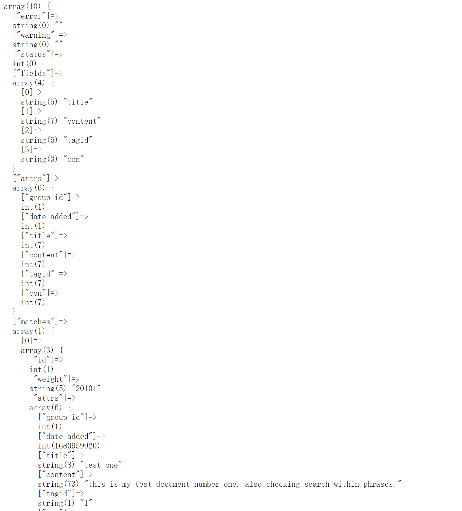

####
   sphinx 全文索引 使用说明 

####
1 解压sphinx-3.4.1-efbcc65-windows-amd64.zip 是windows 安装包, 
导入etc文件夹中 example.sql 数据库文件。在 etc 目录中 sphinx.conf 是配置文件
####
2进入bin 目录下 执行 生成索引文件
.\indexer.exe -c ..\etc\sphinx.conf --all --rotate

####
3 启动服务端
.\searchd.exe -c ..\etc\sphinx.conf 

###
4 执行api 文件夹中的 index.php 就会有 结果展示 如下

实例
1 下载sphinx安装包，我这里选的是windows系统的3.4.1版本：https://sphinxsearch.com/downloads/current/

2 安装后会得到6个文件夹：api,bin,doc,etc,misc,src

3 复制etc目录下的sphinx-min.conf.dist到bin目录下并修改文件名为sphinx.conf。文件内容见代码块：

可参考 https://blog.csdn.net/webnoties/article/details/128726328
以下是sphinx.conf 的配置文件

source src1
{
type            = mysql

    sql_host        = localhost
    sql_user        = root
    sql_pass        = root
    sql_db          = amengcms
    sql_port        = 3306  # optional, default is 3306
 
    #sql_query       = \
    #    SELECT id, group_id, UNIX_TIMESTAMP(date_added) AS date_added, title, content \
    #    FROM documents
    #sql_attr_uint   = group_id
    #sql_attr_uint   = date_added
 
    sql_query        = SELECT id, title, description FROM archives
    sql_field_string = title
    sql_field_string = description
}

index test1
{
source          = src1
path            = F:\x\test\amengcms\ameng_cms\sphinx_data

    mlock = 0 # 缓存内存锁定
    morphology = none # 数据处理方法
    min_word_len = 1 # 最小索引字长
    html_strip = 0 # 是否去除html标签
    ngram_len = 1 # 支持中文
    ngram_chars = U+3000..U+2FA1F # 支持中文
    # 字段配置
    rt_attr_uint = id
    rt_field = title
    rt_field = description
}

index testrt
{
type            = rt
rt_mem_limit    = 128M

    path            = F:\x\test\amengcms\ameng_cms\sphinx_data\testrt
 
    rt_field        = title
    rt_field        = content
    rt_attr_uint    = gid
}

indexer
{
mem_limit       = 128M
}

searchd
{
listen          = 9312
listen          = 9306:mysql41
log             = F:\x\test\amengcms\ameng_cms\sphinx_data\log\searchd.log
query_log       = F:\x\test\amengcms\ameng_cms\sphinx_data\log\query.log
read_timeout    = 5
max_children    = 30
pid_file        = F:\x\test\amengcms\ameng_cms\sphinx_data\log\searchd.pid
seamless_rotate = 1
preopen_indexes = 1
unlink_old      = 1
workers         = threads # for RT to work
binlog_path     = F:\x\test\amengcms\ameng_cms\sphinx_data\log
}
4 打开cmd命令窗口，cd进入到安装路径：D:\soft\sphinx-3.4.1-efbcc65-windows-amd64\sphinx-3.4.1\bin

5 建立索引（mysql数据表每次变化后都要执行该步骤来刷新索引），执行命令，如：

D:\soft\sphinx-3.4.1-efbcc65-windows-amd64\sphinx-3.4.1\bin> .\indexer.exe test1
6 启动命令：

D:\soft\sphinx-3.4.1-efbcc65-windows-amd64\sphinx-3.4.1\bin> .\searchd.exe
7 建立php代码文件sphinx.php：

<?php
require ( "D:\soft\sphinx-3.4.1-efbcc65-windows-amd64\sphinx-3.4.1\api\sphinxapi.php" );
$keywords    = isset($_GET['keywords']) ? $_GET['keywords'] : '分页';
 
$s = new SphinxClient();
$s->setServer("localhost",9312);
$result = $s->query($keywords, "test1");
print_r($result);
exit;
?>
8 浏览器访问即可输出查询结果。

http://localhost/sphinx.php
Array ( [error] => [warning] => [status] => 0 [fields] => Array ( [0] => title [1] => description ) [attrs] => Array ( [title] => 7 [description] => 7 ) [matches] => Array ( [55] => Array ( [weight] => 42485 [attrs] => Array ( [title] => 分页 laypage [description] => 分页 laypage ) ) [70] => Array ( [weight] => 21807 [attrs] => Array ( [title] => 代码高亮显示 code [description] => 分页 laypage ) ) ) [total] => 2 [total_found] => 2 [time] => 0.000 [words] => Array ( [分] => Array ( [docs] => 5 [hits] => 6 ) [页] => Array ( [docs] => 9 [hits] => 10 ) ) )
下面再贴一个多表关联查询的，并且加上唯一ID字段的：

#
# Minimal Sphinx configuration sample (clean, simple, functional)
#

source archives
{
type            = mysql                         #数据库类型
sql_host        = localhost                     #数据库地址
sql_user        = root                          #用户名
sql_pass        = root                        #密码
sql_db          = amengcms                          #数据库名

    sql_port        = 3306                          #端口
    sql_query_pre   = SET NAMES utf8                #编码
 
    #使用多次查询，那么这个多次查询就需要有个范围和步长,sql_query_range和sql_range_step就是做这个使用的。
    sql_query_range =
    sql_range_step  = 10000
    sql_query       = SELECT id,id as id_other,title,description,addonarticle.body FROM archives LEFT JOIN addonarticle ON archives.id=addonarticle.aid 
    sql_attr_uint      = id_other
    sql_field_string = title
    sql_field_string = description
    sql_field_string = body
}

# 主索引index定义
index archives
{
source          = archives                    #对应的source名称
path            = D:\soft\sphinx-3.4.1-efbcc65-windows-amd64\sphinx-3.4.1\data\archives
mlock           = 0
morphology        = none
min_word_len        = 1
html_strip                = 0
ngram_len     = 1
ngram_chars = U+4E00..U+9FBB, U+3400..U+4DB5, U+20000..U+2A6D6, U+FA0E, U+FA0F, U+FA11, U+FA13, U+FA14, U+FA1F, U+FA21, U+FA23, U+FA24, U+FA27, U+FA28, U+FA29, U+3105..U+312C, U+31A0..U+31B7, U+3041, U+3043, U+3045, U+3047, U+3049, U+304B, U+304D, U+304F, U+3051, U+3053, U+3055, U+3057, U+3059, U+305B, U+305D, U+305F, U+3061, U+3063, U+3066, U+3068, U+306A..U+306F, U+3072, U+3075, U+3078, U+307B, U+307E..U+3083, U+3085, U+3087, U+3089..U+308E, U+3090..U+3093, U+30A1, U+30A3, U+30A5, U+30A7, U+30A9, U+30AD, U+30AF, U+30B3, U+30B5, U+30BB, U+30BD, U+30BF, U+30C1, U+30C3, U+30C4, U+30C6, U+30CA, U+30CB, U+30CD, U+30CE, U+30DE, U+30DF, U+30E1, U+30E2, U+30E3, U+30E5, U+30E7, U+30EE, U+30F0..U+30F3, U+30F5, U+30F6, U+31F0, U+31F1, U+31F2, U+31F3, U+31F4, U+31F5, U+31F6, U+31F7, U+31F8, U+31F9, U+31FA, U+31FB, U+31FC, U+31FD, U+31FE, U+31FF, U+AC00..U+D7A3, U+1100..U+1159, U+1161..U+11A2, U+11A8..U+11F9, U+A000..U+A48C, U+A492..U+A4C6

        rt_field = id_other
        rt_field = title
    rt_field = description
    rt_field = body
}

indexer
{
mem_limit       = 128M
}

searchd
{
listen          = 9312
listen          = 9306:mysql41
log         = D:\soft\sphinx-3.4.1-efbcc65-windows-amd64\sphinx-3.4.1\log\searchd.log
query_log       = D:\soft\sphinx-3.4.1-efbcc65-windows-amd64\sphinx-3.4.1\log\query.log
read_timeout        = 5
max_children        = 30
pid_file        = D:\soft\sphinx-3.4.1-efbcc65-windows-amd64\sphinx-3.4.1\log\searchd.pid
seamless_rotate     = 1
preopen_indexes     = 1
unlink_old      = 1
workers         = threads # for RT to work
binlog_path     = D:\soft\sphinx-3.4.1-efbcc65-windows-amd64\sphinx-3.4.1\log
}
注意php文件代码中也要修改索引名称：

<?php
require ( "D:\soft\sphinx-3.4.1-efbcc65-windows-amd64\sphinx-3.4.1\api\sphinxapi.php" );
$keywords    = isset($_GET['keywords']) ? $_GET['keywords'] : '分页';
echo "keywords::{$keywords}  ";
$s = new SphinxClient();
$s->setServer("localhost",9312);
$result = $s->query($keywords, "archives");
print_r($result);
exit;
